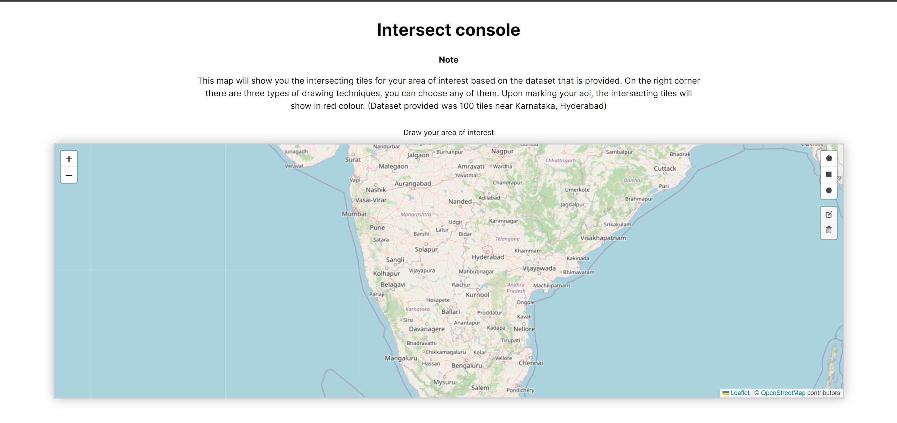
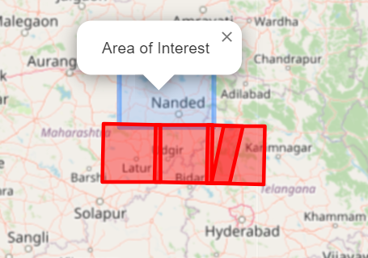
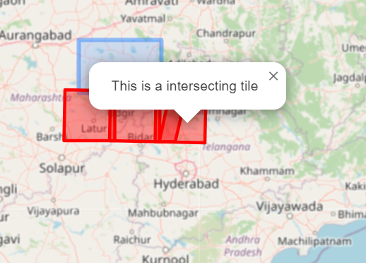

# Intersect Console

Note - Made for GalaxEye Space Assessment

### Problem Description

A user comes to a console which has a base-map and an option to draw an AOI (Area of Interest). Upon selecting and area they will be presented with all the tiles (pre configured satellite image’s metadata) which are intersecting that AOI.

### Given Dataset

**Data details:** 100 tiles covering the whole state of Karnataka. A geojson file named `karnataka.geojson`

### Project Info

This is a geolocation category project by which we can draw a region,**which is called Area of our interest** on the map and based on a dataset which is given.

### Technologies used and How to build and start this project

The technologies which are used:

- Node - version 16
- React - version 18
- Vite - version 4
- react-leaflet - version 4.2.1

As the problem statement inclueded to add docker-compose setup, I have created the required `dockerfile` and `docker-compose.yaml` for this. So to test the code, go to the terminal run `docker-compose build` and it will automatically install all the required packages for us. After that run `docker-compose up` to run the server.

### Approach and Explanation

Approach I took is simple, no heavy design, no fancy things. Just a light themed fully responsive application with a white background, Heading and a Map container. Based on our AOI the interface will show us how many tiles have intersected.

### How to use

As we can see on the above picture right corner there are 5 icons, the first 3 are for drawing a region. The three icons were for Polygon, Circle and Rectangle. We can use any one of them and draw a region.

As we can see when we mark a region which is in blue color, the red tiles are appearing which are intersecting tiles. Clicking on the blue mark will show us `Area of Interest` and clicking on the red mark will show us `This is a intersecting tile`
